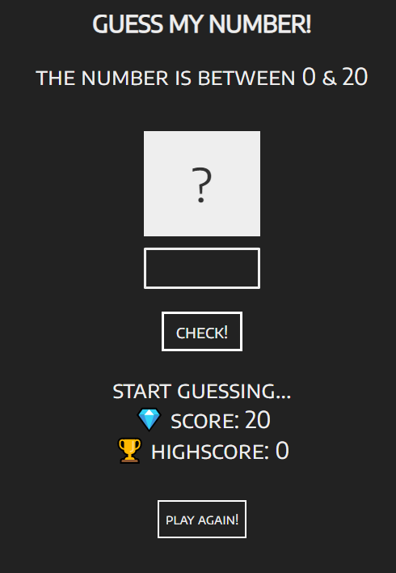
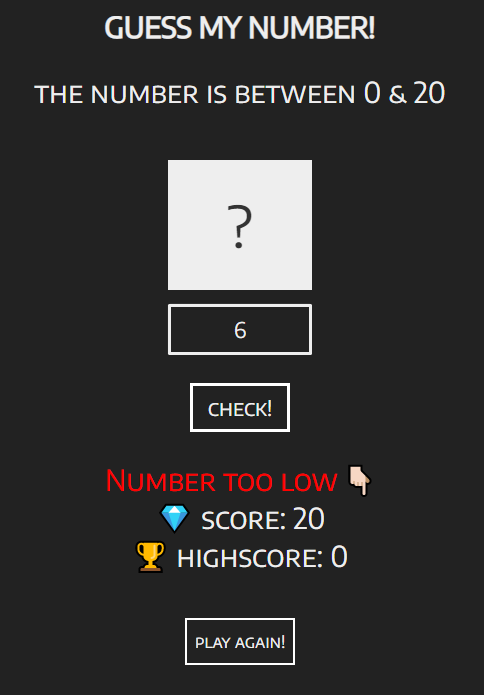
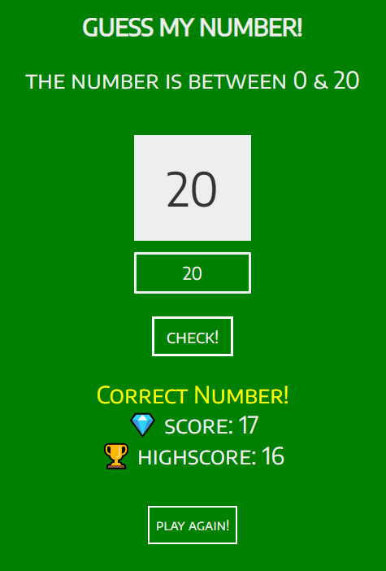

# Guess my number game

Live view: https://martin-kristensen-wd.github.io/Guess-My-Number/

## Screenshot

## Built with

- HTML
- CSS 
- Javascript

## What I learned

### Learned about DOM manipulation. 

I have learned how to select HTML elements and adding event listeners. 

**Code Example:** 
<pre><code>
document.querySelector('.check').addEventListener('click', function () {
  
}
</code></pre>

### Manipulation CSS with javascript. 

I have learned how to use the style property to add CSS styles.

**Code Example:**
<pre><code>
document.querySelector('body').style.backgroundColor = 'green'
document.querySelector('.btn').style.backgroundColor = 'green'
document.querySelector('.again').style.backgroundColor = 'green'
</code></pre>

### Learned how to use Math() function

I have learned how use the Math() function to generate a randwom number

**Code Example:**

<pre><code>
let secretNumber = Math.trunc(Math.random() * 20) +1
</code></pre>

### Useful resources

- [Math()](https://developer.mozilla.org/en-US/docs/Web/JavaScript/Reference/Global_Objects/Math)
- [Event listener](https://developer.mozilla.org/en-US/docs/Web/API/EventListener)
